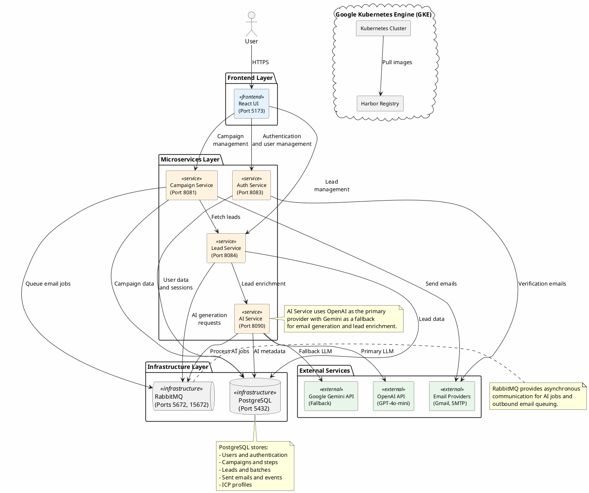

## Overview

The Deployables platform is an AI‑enabled, microservices‑based system for managing B2B cold outreach campaigns. It provides automated lead generation, AI‑assisted email composition, and end‑to‑end campaign orchestration. The system is fully containerized and deployed to Google Kubernetes Engine (GKE).

---

## System Architecture

The platform consists of:

- **Frontend**: A React‑based single‑page application.
- **Microservices**: Java Spring Boot services for authentication, campaigns, and leads.
- **AI Service**: A Python‑based adapter that integrates with external large language models (OpenAI and Google Gemini).
- **Infrastructure**: Shared PostgreSQL and RabbitMQ instances, running inside Kubernetes.

The following PlantUML diagram captures the high‑level architecture:



---

## Technology Stack

### Frontend
- **React** with Vite
- **TailwindCSS** for styling
- **Nginx** for production hosting

### Backend Services
- **Java Spring Boot** microservices
- **PostgreSQL** for persistent data storage
- **RabbitMQ** for asynchronous messaging

### AI Integration
- **OpenAI GPT‑4o‑mini** (primary provider)
- **Google Gemini 2.5 Flash** (fallback provider)

### Infrastructure
- **Docker** for containerization
- **Kubernetes (GKE)** for orchestration
- **Harbor** for container registry
- **GitHub Actions** for CI/CD

---

## Quick Start (Local Development)

### Prerequisites
- Docker and Docker Compose
- Java 17+
- Node.js 18+
- PostgreSQL 16

### 1. Clone the repository

```bash
git clone <repository-url>
cd The-Deployables
```

### 2. Configure environment variables

Create an environment configuration (for example, `.env`) and provide the required secrets:

```bash
export OPENAI_API_KEY=your_openai_api_key
export GEMINI_API_KEY=your_gemini_api_key
export JWT_SECRET=your_jwt_secret
```

### 3. Start local infrastructure and services

```bash
cd infra
docker-compose up --build
```

### 4. Initialize the database schema

```bash
psql -h localhost -U postgres -d outreachdb -f ../db/schema.sql
```

### 5. Access the application

- Frontend: `http://localhost:5173`
- RabbitMQ Management: `http://localhost:15672`
- Auth Service: `http://localhost:8083`
- Campaign Service: `http://localhost:8081`
- Lead Service: `http://localhost:8084`
- AI Service: `http://localhost:8090`

---

## Debugging and Local Access on GKE

When the platform is running on GKE, you can inspect internal dependencies such as PostgreSQL and RabbitMQ by forwarding their ports to your local machine.

### 1. Access the RabbitMQ management console

```bash
kubectl port-forward -n deps-lead-svc svc/rabbitmq 15672:15672
```

Then open `http://localhost:15672` in your browser.  
Default credentials: `guest` / `guest`.

### 2. Access the PostgreSQL database

```bash
kubectl port-forward -n deps-lead-svc svc/postgres-service 5432:5432
```

Then connect using a database client (for example, DBeaver or TablePlus) with the following settings:

- **Host:** `localhost`
- **Port:** `5432`
- **User:** `postgres`
- **Password:** `postgres`
- **Database:** `outreachdb`

### 3. Verify deployments and container images

To confirm that services are running and using the expected Harbor images:

```bash
kubectl get deployments -n deps-lead-svc \
  -o custom-columns='NAME:.metadata.name,IMAGE:.spec.template.spec.containers[0].image'
```

---

## Database Schema

The database schema is defined in `db/schema.sql` and includes tables for:

- User management and authentication
- Mailbox configuration
- ICP (Ideal Customer Profile) targeting
- Lead generation and batches
- Campaign management and sequences
- Email sending and event tracking

---

## CI/CD Pipeline

The project uses GitHub Actions to build, test, and deploy the platform.

### Continuous Integration (CI)
- **Trigger**: Push to the `main` branch
- **Steps**:
  - Build Docker images for all services (`auth-svc`, `campaign-svc`, `lead-svc`, `ai-svc`, `frontend`)
  - Push images to the Harbor registry: `harbor.javajon-gke.duckdns.org/library`

### Continuous Deployment (CD)
- **Trigger**: Successful CI pipeline or manual dispatch
- **Steps**:
  - Connect to the GKE cluster using a kubeconfig file
  - Apply Kubernetes manifests from `infra/k8s/`
  - Update deployment images to the latest commit SHA

### Required GitHub Secrets

Configure the following repository secrets in GitHub:

- `KUBECONFIG_B64`: Base64‑encoded GKE kubeconfig file  
- `HARBOR_USERNAME`: Harbor registry username  
- `HARBOR_PASSWORD`: Harbor registry password  
- `REACT_APP_AUTH_URL`: Frontend auth service URL (optional)  
- `REACT_APP_API_URL`: Frontend API service URL (optional)

To create `KUBECONFIG_B64`:

```bash
# Base64‑encode your GKE kubeconfig file
cat ~/.kube/gke-kubeconfig.yaml | base64
```

Copy the output and store it as the value for `KUBECONFIG_B64` in GitHub Secrets.

---

## Kubernetes Deployment

### Local Kubernetes (Docker Desktop)

For local cluster testing:

1. Ensure Docker Desktop is running and Kubernetes is enabled.
2. Execute the quickstart script:

   ```bash
   ./infra/k8s/quickstart.sh
   ```

3. Access the UI at `http://localhost`.

### Production Deployment (GKE)

Deployment to GKE is primarily handled by the GitHub Actions CD workflow. To deploy manually:

1. **Verify cluster access**

   ```bash
   kubectl config current-context
   kubectl get nodes
   ```

2. **Create namespace and apply configuration**

   ```bash
   kubectl apply -f infra/k8s/namespace.yaml
   kubectl apply -f infra/k8s/configmap.yaml

   # Create Harbor image pull secret
   kubectl create secret docker-registry harbor-registry-secret \
     --docker-server=harbor.javajon-gke.duckdns.org \
     --docker-username=<your-harbor-username> \
     --docker-password=<your-harbor-password> \
     --namespace=deps-lead-svc
   ```

3. **Deploy core services**

   ```bash
   cd infra/k8s
   kubectl apply -f postgres-deploy-k8s.yaml -n deps-lead-svc
   kubectl apply -f rabbitmq-deploy-k8s.yaml -n deps-lead-svc
   kubectl apply -f auth-svc-deploy-k8s.yaml -n deps-lead-svc
   kubectl apply -f lead-deploy-k8s.yaml -n deps-lead-svc
   kubectl apply -f frontend-deploy-k8s.yaml -n deps-lead-svc
   ```

4. **Update deployment images (if required)**

   ```bash
   # Replace <COMMIT_SHA> with your image tag
   kubectl set image deployment/auth-deployment \
     auth-svc=harbor.javajon-gke.duckdns.org/library/auth-svc:<COMMIT_SHA> \
     -n deps-lead-svc
   ```

5. **Verify resources**

   ```bash
   kubectl get pods -n deps-lead-svc
   kubectl get deployments -n deps-lead-svc
   kubectl get svc -n deps-lead-svc
   ```

All sensitive configuration is stored in Kubernetes Secrets, and non‑sensitive configuration is stored in ConfigMaps. No credentials are hard‑coded in the manifests.

---

## Project Status

### Planned
- ⬜ Add AI‑specific citation(s) to this README
- ⬜ Achieve at least 80% unit test coverage across core services

### In Progress
- ⬜ CI builds and pushes all container images to Harbor on GKE (EC)
- ⬜ Obtain data from a public API and integrate it into outreach flows (EC)
- ⬜ CD pulls all container images from Harbor as well as manifests on GKE (EC)
- ⬜ Investigate and resolve email‑related issues (TM)
- ⬜ Diagnose PostgreSQL connectivity issues via `psql` (JJ)

### Completed
- ✅ Initial README and architectural documentation
- ✅ PlantUML system architecture diagram
- ✅ Database instructions and schema
- ✅ Port‑forward configuration for PostgreSQL on GKE
- ✅ Port‑forward configuration for RabbitMQ on GKE
- ✅ Container image builds and push to Harbor on GKE
- ✅ Harbor image pull secret configuration
- ✅ Kubernetes namespaces for the cluster
- ✅ Deployment of core Kubernetes manifests to GKE
- ✅ Integration testing on GKE (email delivery)
- ✅ Use of GitHub Secrets and Kubernetes Secrets (no secrets in the repository)

### Future Enhancements
- Helm chart‑based deployment

---

## AI Capabilities

This project leverages the following AI technologies:

- **OpenAI GPT‑4o‑mini**: Primary language model for email generation and content creation.
- **Google Gemini 2.5 Flash**: Fallback language model for high availability and resiliency.

---

## Contributing

This is a team project for **The Deployables**.  
Core contributors:

- **EC** – CI/CD and external API integration  
- **TM** – Email functionality  
- **JJ** – Database and infrastructure  
- **DS** – System architecture and integration  

Please follow standard GitHub Flow (feature branches and pull requests) when contributing changes.

---

## License

License information has not yet been defined.  
Before using this project in production, add an appropriate open‑source or commercial license (for example, MIT or Apache 2.0) to this section.


