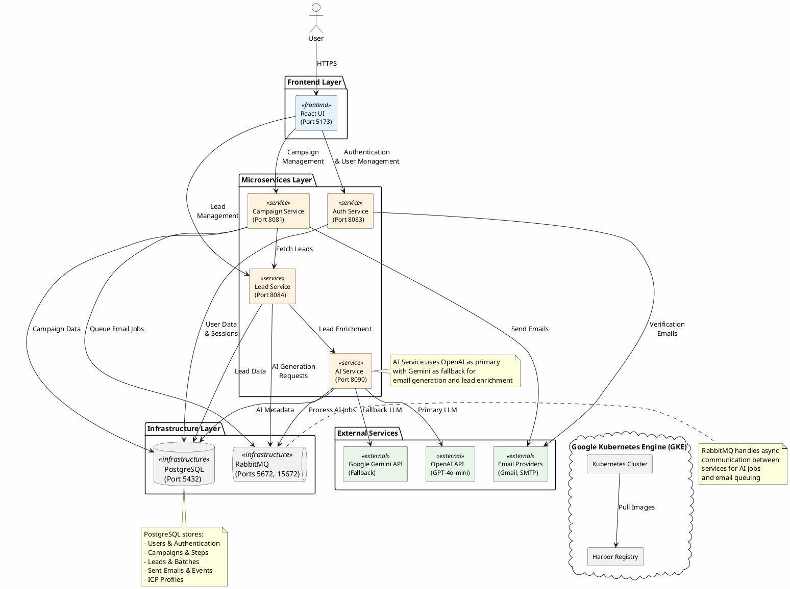

# The Deployables - AI B2B Cold Outreach Platform

An AI-powered microservices platform for B2B cold email outreach campaigns, featuring automated lead generation, intelligent email composition, and comprehensive campaign management.

## System Architecture



## Technology Stack

### Frontend
- **React** with Vite
- **TailwindCSS** for styling
- **Nginx** for production serving

### Backend Services
- **Java Spring Boot** microservices
- **PostgreSQL** for persistent data storage
- **RabbitMQ** for asynchronous messaging

### AI Integration
- **OpenAI GPT-4o-mini** (Primary)
- **Google Gemini 2.5 Flash** (Fallback)

### Infrastructure
- **Docker** for containerization
- **Kubernetes (GKE)** for orchestration
- **Harbor** for container registry
- **GitHub Actions** for CI/CD

## Quick Start

### Prerequisites
- Docker and Docker Compose
- Java 17+
- Node.js 18+
- PostgreSQL 16

### Local Development

1. **Clone the repository**
```bash
git clone <repository-url>
cd The-Deployables
```

2. **Set up environment variables**
```bash
# Create .env file with required secrets
export OPENAI_API_KEY=your_key_here
export GEMINI_API_KEY=your_key_here
export JWT_SECRET=your_secret_here
```

3. **Start all services**
```bash
cd infra
docker-compose up --build
```

4. **Initialize the database**
```bash
psql -h localhost -U postgres -d outreachdb -f ../db/schema.sql
```

5. **Access the application**
- Frontend: http://localhost:5173
- RabbitMQ Management: http://localhost:15672
- Auth Service: http://localhost:8083
- Campaign Service: http://localhost:8081
- Lead Service: http://localhost:8084
- AI Service: http://localhost:8090

## Database Schema

See [db/schema.sql](db/schema.sql) for the complete database schema including:
- User management and authentication
- Mailbox configuration
- ICP (Ideal Customer Profile) targeting
- Lead generation and batches
- Campaign management and sequences
- Email sending and event tracking

## Project Status

### Planned
- ✅ Add the readme
- ✅ Update readme with PlantUML diagram of system components
- ⬜ Add to readme AI citation(s)
- ⬜ Update readme with this task list
- ⬜ Update readme database instructions
- ⬜ Figure out port-forward with Postgres on GKE to connect local code to DB
- ⬜ Figure out port-forward with RabbitMQ on GKE to connect local code to DB
- ⬜ Pushing images to Harbor on GKE
- ⬜ Secret for Harbor image container pulls
- ⬜ Add ingress to access user interface
- ⬜ Add namespace(s) to GKE cluster
- ⬜ Deploy K8s manifests to GKE cluster
- ⬜ Integration test on GKE - ensuring emails are sent
- ⬜ Use GitHub Secrets and K8s Secrets - No secrets in the repo
- ⬜ Use K8s ConfigMaps for non-secret environment variables
- ⬜ 80% unit test coverage

### In Progress
- CI builds and pushes all container images to Harbor on GKE (EC)
- Obtain data from a public API (EC)
- CD pulls all container images from Harbor as well as all YAMLS on GKE (EC)
- Bug with emails (TM)
- Can't connect to Postgres using psql - why? (JJ)

### Completed
- ✅ Postgres engine install on GKE w/ instructions (JJ)
- ✅ Basic services
- ✅ Container image builds
- ✅ Postgres hookups
- ✅ RabbitMQ integration
- ✅ AI integration

### Maybe Later
- Helm chart for deployment

## AI Citations

This project leverages the following AI technologies:
- **OpenAI GPT-4o-mini**: Primary language model for email generation and content creation
- **Google Gemini 2.5 Flash**: Fallback language model for high availability

## Contributing

This is a team project for The Deployables. Team members:
- EC - CI/CD and external API integration
- TM - Email functionality
- JJ - Database and infrastructure
- DS - System architecture and integration

## License

[Add your license information here]

