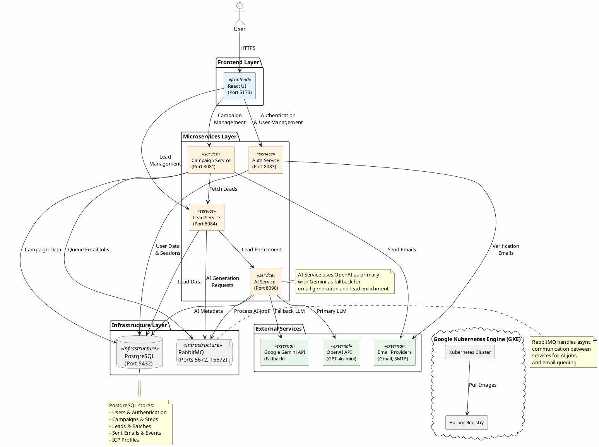

# The Deployables - AI B2B Cold Outreach Platform

An AI-powered microservices platform for B2B cold email outreach campaigns, featuring automated lead generation, intelligent email composition, and comprehensive campaign management.

## System Architecture



## Technology Stack

### Frontend
- **React** with Vite
- **TailwindCSS** for styling
- **Nginx** for production serving

### Backend Services
- **Java Spring Boot** microservices
- **PostgreSQL** for persistent data storage
- **RabbitMQ** for asynchronous messaging

### AI Integration
- **OpenAI GPT-4o-mini** (Primary)
- **Google Gemini 2.5 Flash** (Fallback)

### Infrastructure
- **Docker** for containerization
- **Kubernetes (GKE)** for orchestration
- **Harbor** for container registry
- **GitHub Actions** for CI/CD

## Quick Start

### Prerequisites
- Docker and Docker Compose
- Java 17+
- Node.js 18+
- PostgreSQL 16

### Local Development

1. **Clone the repository**
```bash
git clone <repository-url>
cd The-Deployables
```

2. **Set up environment variables**
```bash
# Create .env file with required secrets
export OPENAI_API_KEY=your_key_here
export GEMINI_API_KEY=your_key_here
export JWT_SECRET=your_secret_here
```

3. **Start all services**
```bash
cd infra
docker-compose up --build
```

4. **Initialize the database**
```bash
psql -h localhost -U postgres -d outreachdb -f ../db/schema.sql
```

5. **Access the application**
- Frontend: http://localhost:5173
- RabbitMQ Management: http://localhost:15672
- Auth Service: http://localhost:8083
- Campaign Service: http://localhost:8081
- Lead Service: http://localhost:8084
- AI Service: http://localhost:8090

## Database Schema

See [db/schema.sql](db/schema.sql) for the complete database schema including:
- User management and authentication
- Mailbox configuration
- ICP (Ideal Customer Profile) targeting
- Lead generation and batches
- Campaign management and sequences
- Email sending and event tracking

## CI/CD Pipeline

The project uses GitHub Actions for automated build and deployment:

### CI Workflow
- **Trigger**: Push to `main` branch
- **Actions**:
  - Builds all Docker images (auth-svc, campaign-svc, lead-svc, ai-svc, frontend)
  - Pushes images to Harbor registry: `harbor.javajon-gke.duckdns.org/library`

### CD Workflow
- **Trigger**: After successful CI workflow completion or manual dispatch
- **Actions**:
  - Connects to GKE cluster using kubeconfig
  - Deploys Kubernetes manifests from `infra/k8s/`
  - Updates deployment images to latest commit SHA

### Setting Up GitHub Secrets

1. **Create KUBECONFIG_B64 Secret**:
   ```bash
   # Base64 encode your GKE kubeconfig file
   cat ~/.kube/gke-kubeconfig.yaml | base64 | pbcopy  # macOS
   # or
   cat ~/.kube/gke-kubeconfig.yaml | base64 -w 0      # Linux
   ```
   
   Then in GitHub:
   - Go to: Settings → Secrets and variables → Actions
   - Click "New repository secret"
   - Name: `KUBECONFIG_B64`
   - Value: Paste the base64-encoded kubeconfig

2. **Required Secrets**:
   - `KUBECONFIG_B64`: Base64-encoded GKE kubeconfig file
   - `HARBOR_USERNAME`: Harbor registry username
   - `HARBOR_PASSWORD`: Harbor registry password
   - `REACT_APP_AUTH_URL`: Frontend auth service URL (optional)
   - `REACT_APP_API_URL`: Frontend API service URL (optional)

## Kubernetes Deployment

### Quick Deploy (Local K8s)

For teammates running this for the first time:

1.  Make sure Docker Desktop is running and Kubernetes is enabled.
2.  Run the automated setup script:

    ```bash
    ./infra/k8s/quickstart.sh
    ```

3.  Access the app at **[http://localhost](http://localhost)**.

### Production Deployment (GKE)

Deployment to GKE is automated via GitHub Actions CD workflow. To deploy manually:

1. **Verify you have kubeconfig configured**:
   ```bash
   kubectl config current-context
   kubectl get nodes
   ```

2. **Create namespace and apply ConfigMap/Secrets**:
   ```bash
   kubectl apply -f infra/k8s/namespace.yaml
   kubectl apply -f infra/k8s/configmap.yaml
   
   # Create Harbor image pull secret
   kubectl create secret docker-registry harbor-registry-secret \
     --docker-server=harbor.javajon-gke.duckdns.org \
     --docker-username=<your-harbor-username> \
     --docker-password=<your-harbor-password> \
     --namespace=deps-lead-svc
   ```

3. **Deploy services**:
   ```bash
   cd infra/k8s
   kubectl apply -f postgres-deploy-k8s.yaml -n deps-lead-svc
   kubectl apply -f rabbitmq-deploy-k8s.yaml -n deps-lead-svc
   kubectl apply -f auth-svc-deploy-k8s.yaml -n deps-lead-svc
   kubectl apply -f lead-deploy-k8s.yaml -n deps-lead-svc
   kubectl apply -f frontend-deploy-k8s.yaml -n deps-lead-svc
   ```

4. **Update deployment images** (if deploying manually):
   ```bash
   # Replace <COMMIT_SHA> with your image tag
   kubectl set image deployment/auth-deployment \
     auth-svc=harbor.javajon-gke.duckdns.org/library/auth-svc:<COMMIT_SHA> \
     -n deps-lead-svc
   ```

5. **Verify deployment**:
   ```bash
   kubectl get pods -n deps-lead-svc
   kubectl get deployments -n deps-lead-svc
   kubectl get svc -n deps-lead-svc
   ```

**Note**: All environment variables are managed via ConfigMaps (non-sensitive) and Secrets (sensitive). No credentials are hardcoded in deployment files.

## Project Status


### Planned
- ✅ Add the readme
- ✅ Update readme with PlantUML diagram of system components
- ⬜ Add to readme AI citation(s)
- ⬜ Update readme with this task list
- ⬜ Update readme database instructions
- ⬜ Integration test on GKE - ensuring emails are sent

### In Progress
- CI builds and pushes all container images to Harbor on GKE (EC)
- Obtain data from a public API (EC)
- CD pulls all container images from Harbor as well as all YAMLS on GKE (EC)
- Bug with emails (TM)
- - ⬜ 80% unit test coverage (EC)
- Can't connect to Postgres using psql - why? (JJ)

### Completed
- ✅ Postgres engine install on GKE w/ instructions (JJ)
- ✅ Basic services
- ✅ Container image builds
- ✅ Postgres hookups
- ✅ RabbitMQ integration
- ✅ AI integration
- ✅ Use K8s ConfigMaps for non-secret environment variables
- ✅ Add ingress to access user interface
- ⬜ Secret for Harbor image container pulls
- - ⬜ Figure out port-forward with Postgres on GKE to connect local code to DB (DS)
- ⬜ Figure out port-forward with RabbitMQ on GKE to connect local code to DB (DS)
- ⬜ Add namespace(s) to GKE cluster
- - ⬜ Use GitHub Secrets and K8s Secrets - No secrets in the repo
- ⬜ Deploy K8s manifests to GKE cluster
  -  ⬜ Pushing images to Harbor on GKE
 -  
### Maybe Later
- Helm chart for deployment

## AI Citations

This project leverages the following AI technologies:
- **OpenAI GPT-4o-mini**: Primary language model for email generation and content creation
- **Google Gemini 2.5 Flash**: Fallback language model for high availability

## Contributing

This is a team project for The Deployables. Team members:
- EC - CI/CD and external API integration
- TM - Email functionality
- JJ - Database and infrastructure
- DS - System architecture and integration

## License

[Add your license information here]

